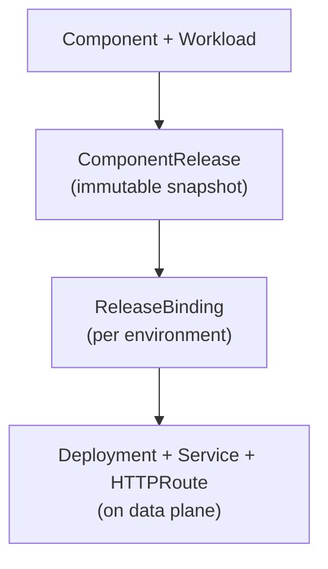

# Deploying Applications

OpenChoreo deploys your components through a chain of resources that separate what you want to deploy from where and how it gets deployed. This model enables reliable rollbacks, environment-specific configuration, and controlled promotion across environments.

## How Deployment Works

When you create a Component and Workload, OpenChoreo creates a deployment chain:



- **ComponentRelease**: an immutable snapshot that freezes your Component's configuration, including the ComponentType spec, Traits, parameters, and Workload. A new release is only created when something changes.
- **ReleaseBinding**: binds a ComponentRelease to a specific environment (e.g., development, staging, production). This is where environment-specific overrides are applied.
- **Kubernetes resources**: the ReleaseBinding produces the final Deployment, Service, and HTTPRoute resources on the data plane.

## Deployment Pipeline

Each Project references a DeploymentPipeline that defines the promotion order between environments. For example, the default pipeline promotes through:

```text
development → staging → production
```

When you deploy a component, it goes to the first environment in the pipeline. You then promote it to subsequent environments either manually or automatically.

## autoDeploy

When `autoDeploy: true` is set on a Component, OpenChoreo automatically creates a ReleaseBinding for the first environment in the deployment pipeline whenever a new ComponentRelease is created. This means:

- Creating a Component with `autoDeploy: true` deploys it to the first environment immediately
- Updating the Workload creates a new release and deploys it automatically
- You still need to promote to subsequent environments manually or via GitOps

Without `autoDeploy`, you deploy manually using the CLI or Backstage UI.

## What's Next

- [Deploy and Promote](./deploy-and-promote.md): deploy to environments and promote across the pipeline
- [Environment Overrides](./environment-overrides.md): configure environment-specific parameters
- [Logs and Troubleshooting](./logs-and-troubleshooting.md): view logs and manage deployments
