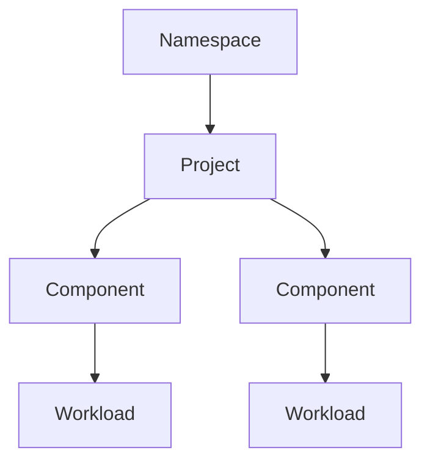

# Projects and Components

OpenChoreo organizes applications using a simple hierarchy: **Namespaces** contain **Projects**, and Projects contain **Components**. As a developer, you create Projects to group related services and Components to define each deployable unit.

## Resource Hierarchy



- **Namespace**: your team or organization boundary, managed by platform engineers
- **Project**: a logical grouping of related components that share a deployment pipeline
- **Component**: a single deployable unit (service, web app, scheduled task) that references a platform-defined template
- **Workload**: the runtime specification for a component (container image, endpoints, environment variables, dependencies)

## ComponentTypes and Traits

Platform engineers define **ComponentTypes** that serve as templates for how your application gets deployed. When you create a Component, you reference one of these templates by name:

```yaml
componentType:
  kind: ClusterComponentType
  name: deployment/service
```

The ComponentType determines the workload type (Deployment, StatefulSet, CronJob, etc.), default parameters, and what Kubernetes resources get created.

You can list available ComponentTypes using:

```bash
occ clustercomponenttype list
occ componenttype list
```

**Traits** are reusable cross-cutting concerns (like observability alerting or OAuth2 proxy) that you can attach to your Component. Each trait instance has a unique name and its own parameters:

```yaml
traits:
  - kind: ClusterTrait
    name: observability-alert-rule
    instanceName: high-error-rate
    parameters:
      condition: "error_count > 100"
```

## Deployment Patterns

There are two ways to deploy a component, depending on whether you have a pre-built container image or want OpenChoreo to build from source.

### From a Pre-built Image

You provide the container image directly in a Workload resource. OpenChoreo deploys it without any build step.

```text
Component (references ComponentType)
    +
Workload (container image, endpoints, env vars)
    ↓
OpenChoreo deploys to environments
```

This pattern is used when:

- You have an existing CI system (GitHub Actions, GitLab CI, Jenkins)
- You are deploying a third-party or pre-built image
- You want full control over the build process

### From Source Code

You configure a workflow on the Component that builds your source code into a container image. OpenChoreo runs the build and creates the Workload automatically.

```text
Component (references ComponentType + Workflow)
    ↓
WorkflowRun (builds container image)
    ↓
Workload (generated from build output + workload.yaml descriptor)
    ↓
OpenChoreo deploys to environments
```

This pattern is used when:

- You want OpenChoreo to handle your CI pipeline
- You are using Docker, Buildpacks, or other supported build methods
- You want auto-build on Git push

## What's Next

- [Creating a Project](./creating-a-project.md): set up a project to organize your components
- [Creating a Component](./creating-a-component.md): deploy your first service or web application
