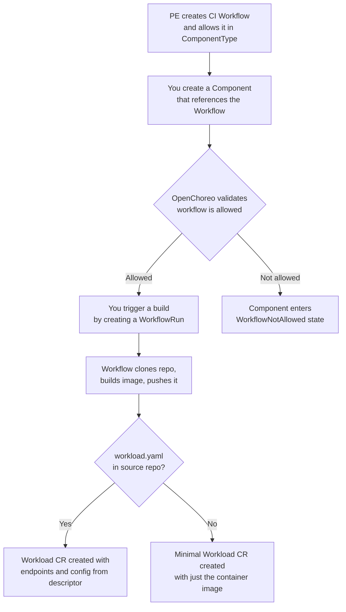

# CI Workflows

CI workflows build your source code into container images and create Workload CRs that OpenChoreo deploys. They are regular [Workflows](../../../platform-engineer-guide/workflows/overview.md) that your platform engineer has configured for component builds.

## How It Works



## Configuring Your Component for CI

Reference a CI workflow in your Component's `spec.workflow` field:

```yaml
apiVersion: openchoreo.dev/v1alpha1
kind: Component
metadata:
  name: greeting-service
  namespace: default
spec:
  owner:
    projectName: default

  componentType:
    kind: ClusterComponentType
    name: deployment/service

  autoDeploy: true

  workflow:
    kind: ClusterWorkflow
    name: dockerfile-builder
    parameters:
      repository:
        url: "https://github.com/openchoreo/sample-workloads"
        revision:
          branch: "main"
        appPath: "/service-go-greeter"
      docker:
        context: "/service-go-greeter"
        filePath: "/service-go-greeter/Dockerfile"
```

Key fields:

- **`workflow.kind`** — `ClusterWorkflow` (cluster-scoped) or `Workflow` (namespace-scoped)
- **`workflow.name`** — Name of the CI workflow to use (must be allowed by your ComponentType)
- **`workflow.parameters`** — Build parameters (repository URL, branch, app path, and builder-specific options)
- **`autoDeploy`** — When `true`, the generated Workload is automatically deployed after a successful build

## Available CI Workflows

OpenChoreo ships with four default CI workflows. Your platform engineer may have configured additional ones or restricted which are available for your ComponentType.

| Workflow                      | Description                                | Builder-specific parameters         |
| ----------------------------- | ------------------------------------------ | ----------------------------------- |
| `dockerfile-builder`          | Build with a Dockerfile/Containerfile      | `docker.context`, `docker.filePath` |
| `gcp-buildpacks-builder`      | Go, Java, Node.js, Python, .NET            | `buildEnv` (optional)               |
| `paketo-buildpacks-builder`   | Java, Node.js, Python, Go, .NET, Ruby, PHP | `buildEnv` (optional)               |
| `ballerina-buildpack-builder` | Ballerina applications                     | `buildEnv` (optional)               |

All workflows share common repository parameters:

| Parameter                    | Description                        | Default    |
| ---------------------------- | ---------------------------------- | ---------- |
| `repository.url`             | Git repository URL                 | (required) |
| `repository.revision.branch` | Branch to build                    | `main`     |
| `repository.revision.commit` | Specific commit SHA (optional)     | latest     |
| `repository.appPath`         | Path to application directory      | `.`        |
| `repository.secretRef`       | Secret reference for private repos | (none)     |

## Triggering a Build

The simplest way to trigger a build is using the `occ` CLI:

```bash
occ component workflow run greeting-service
```

This creates a WorkflowRun using the workflow configured in your Component's `spec.workflow`.

Alternatively, you can create a WorkflowRun YAML and apply it:

```yaml
apiVersion: openchoreo.dev/v1alpha1
kind: WorkflowRun
metadata:
  name: greeting-service-build-01
  labels:
    openchoreo.dev/project: "default"
    openchoreo.dev/component: "greeting-service"
spec:
  workflow:
    kind: ClusterWorkflow
    name: dockerfile-builder
    parameters:
      repository:
        url: "https://github.com/openchoreo/sample-workloads"
        revision:
          branch: "main"
        appPath: "/service-go-greeter"
      docker:
        context: "/service-go-greeter"
        filePath: "/service-go-greeter/Dockerfile"
```

```bash
occ apply -f workflowrun.yaml
```

The `openchoreo.dev/project` and `openchoreo.dev/component` labels link the build to your Component. These labels are required for CI workflows.

## Monitoring a Build

```bash
# Get build status
occ workflowrun get greeting-service-build-01

# List all workflow runs
occ workflowrun list

# List workflow runs for a specific component
occ component workflowrun list greeting-service
```

### Build Logs

View live or archived build logs:

```bash
# View logs for a build
occ workflowrun logs greeting-service-build-01

# Follow logs in real-time
occ workflowrun logs greeting-service-build-01 -f

# View logs for a component's latest build
occ component workflowrun logs greeting-service
```

### Build Conditions

| Condition           | Description                          |
| ------------------- | ------------------------------------ |
| `WorkflowRunning`   | Build is currently executing         |
| `WorkflowCompleted` | Build completed (success or failure) |
| `WorkflowSucceeded` | Build completed successfully         |
| `WorkflowFailed`    | Build failed or errored              |

### Build Steps

The `status.tasks` field shows individual step progress:

```yaml
status:
  tasks:
    - name: checkout-source
      phase: Succeeded
    - name: containerfile-build
      phase: Succeeded
    - name: publish-image
      phase: Succeeded
    - name: generate-workload-cr
      phase: Running
```

Step phases: `Pending`, `Running`, `Succeeded`, `Failed`, `Skipped`, `Error`.

## External CI

If your organization uses an external CI platform (e.g., Jenkins, GitHub Actions) instead of OpenChoreo's built-in CI, you can create a Component with **External CI** as the deployment source:

1. Navigate to **Create** in Backstage
2. Select your component type and fill in **Component Metadata**
3. In the **Build & Deploy** step, under **Deployment Source**, select **"External CI"**
4. Optionally select your **CI Platform** (e.g., Jenkins) to enable build visibility in Backstage, and provide the **Jenkins Job Path** (e.g., `/job/my-org/job/my-service`)
5. Complete the remaining steps and review

The component is created without a workload. Your CI pipeline will create workloads when builds complete by calling the OpenChoreo Workload API:

```
POST /api/v1/namespaces/{namespaceName}/workloads
Authorization: Bearer <token>
Content-Type: application/json
```

Your platform engineer sets up the OAuth credentials and Jenkins/CI visibility in Backstage. See the [External CI Integration](../../../platform-engineer-guide/workflows/external-ci.mdx) guide for the full setup.

## Troubleshooting

### WorkflowNotAllowed

Your Component references a workflow that your ComponentType does not permit:

```yaml
conditions:
  - type: Ready
    status: False
    reason: WorkflowNotAllowed
    message: "Workflow 'custom-workflow' is not in ComponentType 'backend' allowedWorkflows"
```

Ask your platform engineer to add the workflow to the ComponentType's `allowedWorkflows`, or use a different workflow.

### WorkflowRun Validation Errors

When a WorkflowRun is created with component labels, the controller validates it before execution:

| Validation                 | Condition Reason            | What to check                                                                 |
| -------------------------- | --------------------------- | ----------------------------------------------------------------------------- |
| Both labels required       | `ComponentValidationFailed` | Ensure both `openchoreo.dev/project` and `openchoreo.dev/component` are set   |
| Component exists           | `ComponentValidationFailed` | Verify the Component exists in the same namespace                             |
| Project label matches      | `ComponentValidationFailed` | Ensure the project label matches the Component's owner project                |
| Workflow allowed           | `ComponentValidationFailed` | Use a workflow listed in your ComponentType's `allowedWorkflows`              |
| Workflow matches component | `ComponentValidationFailed` | WorkflowRun must reference the same workflow as the Component                 |
| Workflow exists            | `WorkflowNotFound`          | Verify the ClusterWorkflow or Workflow exists                                 |
| WorkflowPlane available    | `WorkflowPlaneNotFound`     | Ask your platform engineer to check the WorkflowPlane (retried automatically) |

`ComponentValidationFailed` conditions are permanent — fix the issue and create a new WorkflowRun. `WorkflowPlaneNotFound` is transient and retried automatically.

## What's Next

- [Workload Descriptor](./workload-descriptor.md) — Customize what your build produces with a `workload.yaml` file
- [Auto-Build](./auto-build.md) — Trigger builds automatically on Git push
- [Private Repository](./private-repository.md) — Configure access to private Git repositories
