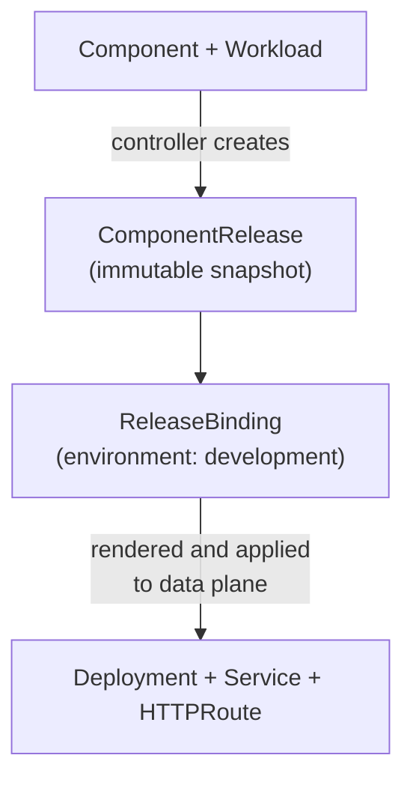

import CodeBlock from "@theme/CodeBlock";
import { versions } from "../_constants.mdx";

# Deploy and Explore

This guide walks you through deploying a component on OpenChoreo and exploring what the platform creates behind the scenes. By the end, you'll understand the full resource chain, from the Component you define to the Kubernetes Deployment running your code.

:::tip Already deployed via Quick Start?
If you followed the [Quick Start Guide](./quick-start-guide.mdx), you've already deployed a sample app. This page revisits the process step by step so you can understand what each resource does.
:::

## Prerequisites

- **OpenChoreo installed** on your cluster (see [Local Setup](./try-it-out/on-k3d-locally.mdx) or [Your Own Cluster](./try-it-out/on-your-environment.mdx))
- **kubectl** configured and pointing at your cluster

## Deploy the Sample

We'll deploy the Go Greeter Service from a pre-built container image. The sample YAML contains two key resources:

- **Component**: declares the application, referencing the `deployment/service` ClusterComponentType
- **Workload**: specifies the container image, ports, environment variables, and an external endpoint

<CodeBlock language="bash">
  {`kubectl apply -f https://raw.githubusercontent.com/openchoreo/openchoreo/${versions.githubRef}/samples/from-image/go-greeter-service/greeter-service.yaml`}
</CodeBlock>

Wait for the deployment to be ready:

```bash
kubectl wait --for=condition=Ready component/greeter-service -n default --timeout=120s
```

## Explore What OpenChoreo Created

When you applied those three resources, OpenChoreo's controllers reconciled them and created a chain of resources automatically. Let's walk through each one.

### The Resource Chain



### 1. Component

The Component declares your application and links it to a platform-defined template (ClusterComponentType). For this sample, OpenChoreo automatically creates a release and deploys it to the environments in the deployment pipeline.

```bash
kubectl get component greeter-service -n default
```

Inspect the status to see which ComponentRelease was created:

```bash
kubectl get component greeter-service -n default -o jsonpath='{.status.latestRelease.name}'
```

```text
greeter-service-5d7f658d9c
```

The suffix is a hash derived from the release spec, so your value may differ.

### 2. ComponentRelease

The ComponentRelease is an **immutable snapshot** that freezes the Component's configuration, including the ComponentType spec, Trait definitions, parameters, and Workload. This enables reliable rollbacks and audit trails.

```bash
kubectl get componentrelease -n default
```

The name (`greeter-service-5d7f658d9c`) includes a hash of the spec, so a new release is only created when something actually changes.

### 3. ReleaseBinding

The ReleaseBinding binds a ComponentRelease to a specific environment. It references the release name and the target environment (`development`). This is where environment-specific overrides (like replica counts or resource limits) can be applied.

```bash
kubectl get releasebinding greeter-service-development -n default
```

The name follows the convention `{component}-{environment}`.

### 4. Underlying Kubernetes Resources

From the ReleaseBinding, OpenChoreo renders the final Kubernetes manifests and applies them to a data plane namespace:

- **Deployment**: manages the pod running your container image
- **Service**: provides stable networking for the pod
- **HTTPRoute**: configures the API gateway to route external traffic to your service

```bash
kubectl get deployment,svc,httproute -A -l openchoreo.dev/component=greeter-service
```

Notice these resources live in a data plane namespace (e.g., `dp-default-default-development-*`), not in the `default` namespace where you created your Component. This separation is by design: the control plane manages intent while the data plane runs workloads.

## Test the Running Service

Verify the service is accessible through the gateway:

```bash
curl http://development-default.openchoreoapis.localhost:19080/greeter-service-http/greeter/greet
```

```text
Hello, Stranger!
```

Try it with a name parameter:

```bash
curl "http://development-default.openchoreoapis.localhost:19080/greeter-service-http/greeter/greet?name=OpenChoreo"
```

```text
Hello, OpenChoreo!
```

The URL structure is: `http://{environment}-{namespace}.{gateway-host}/{endpoint-name}/{path}`

## Summary

You applied a Component and Workload, and OpenChoreo automatically created the full deployment chain:

**Component** → **ComponentRelease** (immutable snapshot) → **ReleaseBinding** (binds to environment) → **Deployment + Service + HTTPRoute** (running on data plane)

To learn more about these abstractions, see [Resource Relationships](../concepts/resource-relationships.md) and [Runtime Model](../concepts/runtime-model.md).

## Clean Up

To remove the sample:

<CodeBlock language="bash">
  {`kubectl delete -f https://raw.githubusercontent.com/openchoreo/openchoreo/${versions.githubRef}/samples/from-image/go-greeter-service/greeter-service.yaml`}
</CodeBlock>
