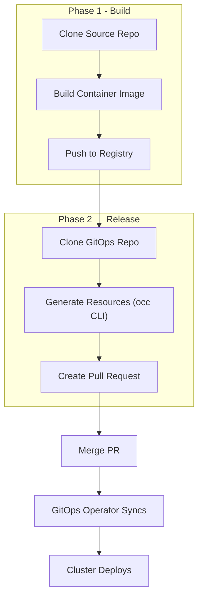

# Build and Release Workflows

When using a GitOps approach, deploying a Component requires three resources in your GitOps repository: a **Workload** (container image and endpoint configuration), a **ComponentRelease** (immutable release snapshot), and a **ReleaseBinding** (binds the release to an Environment). Creating these by hand for every build is tedious and error-prone.

OpenChoreo provides build-and-release Workflows that automate this entire cycle. They build a container image from source code, generate the required resources using the `occ` CLI, and open a pull request in your GitOps repository. Once the PR is merged, your GitOps operator (e.g., Flux CD) syncs the resources to the cluster.

## How It Works

All build-and-release workflows follow a two-phase architecture:



**Phase 1 — Build:** Clones the source repository, builds a container image using the workflow-specific method (Docker, Buildpacks, or Node.js + nginx), and pushes it to the container registry.

**Phase 2 — Release:** Clones the GitOps repository, creates a feature branch (`release/<component>-<timestamp>`), runs `occ` CLI commands to generate Workload, ComponentRelease, and ReleaseBinding resources, and opens a pull request for review.

## Available Workflows

| Workflow                                 | Use Case                                   | Build Method            |
| ---------------------------------------- | ------------------------------------------ | ----------------------- |
| `docker-gitops-release`                  | General-purpose services with a Dockerfile | Docker (Podman)         |
| `google-cloud-buildpacks-gitops-release` | Source-to-image without a Dockerfile       | Google Cloud Buildpacks |
| `react-gitops-release`                   | React/SPA frontend applications            | Node.js + nginx         |

For detailed workflow configuration, parameters, installation, and usage examples, see the [Workflow Reference](https://github.com/openchoreo/sample-gitops/blob/main/namespaces/default/platform/workflows/README.md#build-and-release-workflows) in the sample-gitops repository.

:::info Platform Engineer Configuration
GitOps repository details such as the repository URL, branch, container registry, and image naming are configured by platform engineers directly in the Workflow resource's `runTemplate`, not by developers in the WorkflowRun. Developers only need to provide build-specific parameters (e.g., Dockerfile path, build context) and source repository details.

Workflow triggering is flexible. For example, if you need auto-build capabilities, you can follow a similar approach to [Auto Build](../../workflows/auto-build.mdx).
:::

## Generating Resources with the CLI

During the release phase, workflows use three `occ` CLI commands sequentially to generate the GitOps resources:

### 1. Create Workload

Creates or updates the Workload resource with the container image reference and endpoint configuration from the workload descriptor:

```bash
occ workload create \
  --mode file-system \
  --root-dir <gitops-repo-path> \
  --project <project> \
  --component <component> \
  --image <container-image> \
  --descriptor <workload-descriptor-path>  # optional
```

### 2. Generate ComponentRelease

Generates an immutable ComponentRelease snapshot from the Component, Workload, ComponentType, and Trait definitions:

```bash
occ componentrelease generate \
  --mode file-system \
  --root-dir <gitops-repo-path> \
  --project <project> \
  --component <component> \
  --name <release-name> \
  --output-path <output-path>
```

### 3. Generate ReleaseBinding

Generates a ReleaseBinding that binds the ComponentRelease to the target Environment:

```bash
occ releasebinding generate \
  --mode file-system \
  --root-dir <gitops-repo-path> \
  --project <project> \
  --component <component> \
  --component-release <release-name>
```

You can run these commands manually outside of workflows to generate resources in your GitOps repository. For the full list of flags and options, see the [CLI Reference](../../../reference/cli-reference.md).

## See Also

- [Bulk Promote](./bulk-promote.mdx) — Promote multiple components to an Environment at once
- [Auto Build](../../workflows/auto-build.mdx) — Trigger workflows automatically on Git push via webhooks
- [GitOps Overview](../overview.md) — Repository patterns and best practices
- [CLI Reference](../../../reference/cli-reference.md) — Complete `occ` command reference
