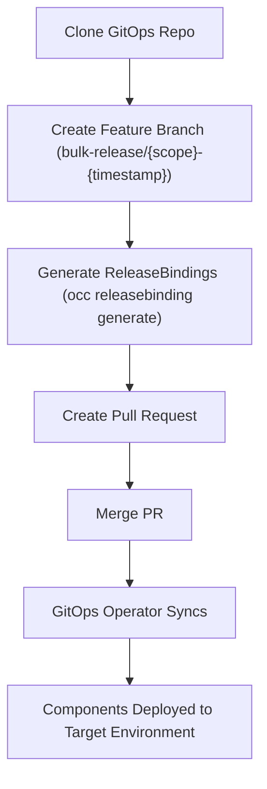

# Bulk Promote Workflow

After building and releasing Components to an initial Environment (e.g., development), you often need to promote them to the next Environment (e.g., staging or production). Doing this one Component at a time is slow when a project has many Components.

The Bulk GitOps Promote workflow generates or updates ReleaseBindings for multiple Components in a single operation. Unlike [build-and-release workflows](./build-and-release-workflows.mdx), it has no build phase. It operates purely on the GitOps repository to bind existing ComponentReleases to a target Environment.

## How It Works



The workflow clones your GitOps repository, uses the `occ releasebinding generate` command to create ReleaseBindings for all Components in scope, and opens a pull request. Once merged, your GitOps operator syncs the new bindings, deploying the Components to the target Environment.

:::important ComponentReleases Required
Components must be built first using [build-and-release workflows](./build-and-release-workflows.mdx) before they can be promoted. The bulk promote workflow binds **existing** ComponentReleases to a new Environment.
:::

## When to Use

- **Coordinated multi-component promotions** — Promote all Components to staging at once
- **Production rollouts** — Promote an entire project to production
- **Initial Environment bootstrapping** — Create bindings for all Components in a new Environment

For detailed workflow configuration, parameters, and installation instructions, see the [Workflow Reference](https://github.com/openchoreo/sample-gitops/blob/main/namespaces/default/platform/workflows/README.md#promotion-workflow) in the sample-gitops repository.

## Generating ReleaseBindings with the CLI

The workflow internally uses the `occ releasebinding generate` command. You can also run it manually or re-use it in your customized automations appropriately:

### Promote all Components across all projects

```bash
occ releasebinding generate --all \
  --mode file-system \
  --root-dir <gitops-repo-path> \
  --target-env <environment> \
  --use-pipeline <pipeline>
```

### Promote all Components in a specific project

```bash
occ releasebinding generate --project <project> \
  --mode file-system \
  --root-dir <gitops-repo-path> \
  --target-env <environment> \
  --use-pipeline <pipeline>
```

### Promote a specific Component

```bash
occ releasebinding generate --project <project> --component <component> \
  --mode file-system \
  --root-dir <gitops-repo-path> \
  --target-env <environment> \
  --component-release <release-name>  # optional, defaults to latest
```

For the full list of flags and options, see the [CLI Reference](../../../reference/cli-reference.md).

## See Also

- [Build and Release Workflows](./build-and-release-workflows.mdx) — Automate container builds and GitOps releases
- [GitOps Overview](../overview.md) — Repository patterns and best practices
- [ReleaseBinding API Reference](../../../reference/api/platform/releasebinding.md) — ReleaseBinding resource specification
- [CLI Reference](../../../reference/cli-reference.md) — Complete `occ` command reference
