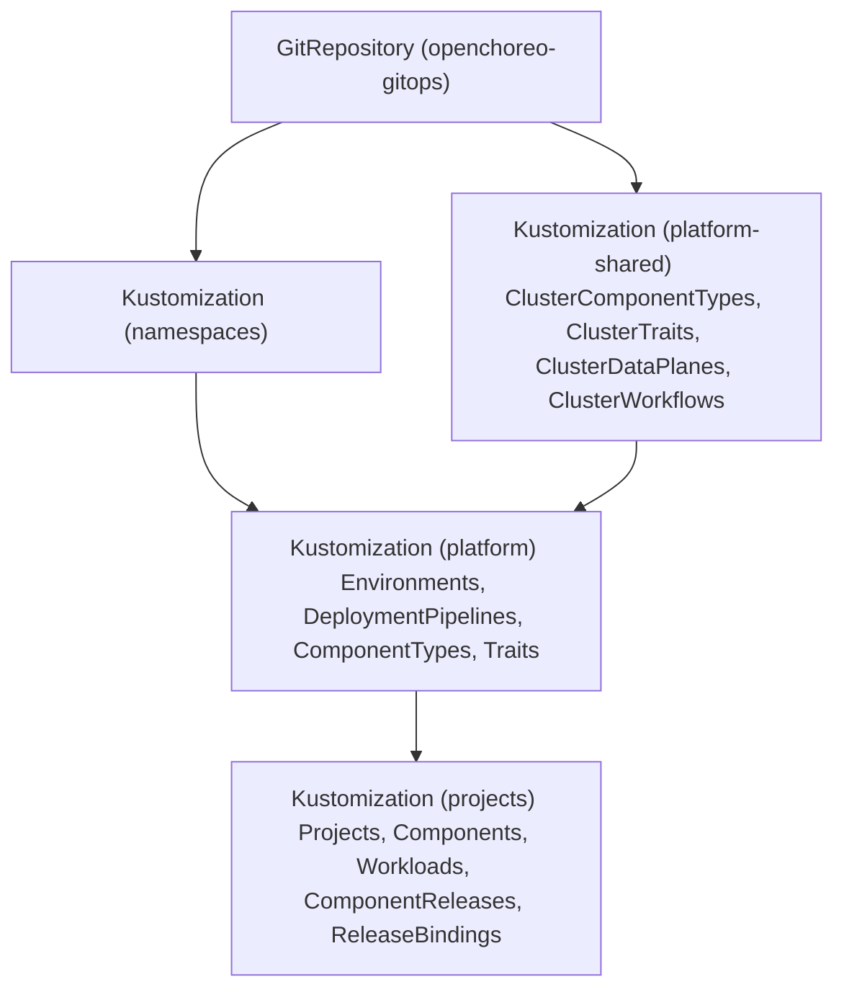

# Using Flux CD

[Flux CD](https://fluxcd.io/) is a set of continuous delivery tools that keeps Kubernetes clusters in sync with configuration sources like Git repositories. For OpenChoreo integration, Flux's **kustomize-controller** automatically applies OpenChoreo resources from Git to your cluster.

When combined with OpenChoreo, Flux CD enables you to:

- **Declaratively manage OpenChoreo resources** — Store Projects, Components, Workloads, and other resources in Git
- **Automate deployments** — Changes pushed to Git are automatically applied to your cluster
- **Maintain audit trails** — Git history provides a complete record of all changes
- **Enable GitOps workflows** — Use pull requests for review and approval before changes are applied

## Flux Resources Overview

To sync OpenChoreo resources from Git, you need two types of Flux resources:

| Resource          | Purpose                                                                      |
| ----------------- | ---------------------------------------------------------------------------- |
| **GitRepository** | Defines the Git repository source that Flux monitors for changes             |
| **Kustomization** | Defines which path in the repository to apply and how to reconcile resources |

### GitRepository

A `GitRepository` resource points Flux to your OpenChoreo configuration repository:

```yaml
apiVersion: source.toolkit.fluxcd.io/v1
kind: GitRepository
metadata:
  name: openchoreo-gitops
  namespace: flux-system
spec:
  interval: 1m
  url: https://github.com/<your-org>/<your-repo>
  ref:
    branch: main
```

For private repositories, add a secret reference:

```yaml
spec:
  secretRef:
    name: git-credentials
```

### Kustomizations

Create `Kustomization` resources to sync different parts of your repository. Use the `dependsOn` field to ensure resources are created in the correct order — cluster-scoped resources first, then platform resources, then application resources.



**Cluster-scoped resources** (`platform-shared/`):

```yaml
apiVersion: kustomize.toolkit.fluxcd.io/v1
kind: Kustomization
metadata:
  name: openchoreo-platform-shared
  namespace: flux-system
spec:
  interval: 5m
  path: ./platform-shared
  prune: true
  sourceRef:
    kind: GitRepository
    name: openchoreo-gitops
```

**Platform resources** (depends on namespaces and platform-shared):

```yaml
apiVersion: kustomize.toolkit.fluxcd.io/v1
kind: Kustomization
metadata:
  name: openchoreo-platform
  namespace: flux-system
spec:
  interval: 5m
  path: ./namespaces/<namespace>/platform
  prune: true
  targetNamespace: <namespace>
  sourceRef:
    kind: GitRepository
    name: openchoreo-gitops
  dependsOn:
    - name: openchoreo-platform-shared
```

**Projects and Components** (depends on platform):

```yaml
apiVersion: kustomize.toolkit.fluxcd.io/v1
kind: Kustomization
metadata:
  name: openchoreo-projects
  namespace: flux-system
spec:
  interval: 5m
  path: ./namespaces/<namespace>/projects
  prune: true
  targetNamespace: <namespace>
  sourceRef:
    kind: GitRepository
    name: openchoreo-gitops
  dependsOn:
    - name: openchoreo-platform
```

:::tip Flexible Kustomization Patterns
The structure above follows the [Mono Repository](./overview.md#mono-repository) pattern. You can define Kustomizations to match your team's workflow — per-project, per-component, per-environment, or any combination. OpenChoreo's resource model works with any pattern.
:::

## Tutorial

For a hands-on walkthrough that covers setting up Flux CD, building and deploying a multi-component application, and promoting across environments, follow the [GitOps with Flux CD tutorial](https://github.com/openchoreo/sample-gitops/blob/main/flux/README.md) in the sample-gitops repository.

## See Also

- [GitOps Overview](./overview.md) — Repository patterns and best practices
- [Flux CD Documentation](https://fluxcd.io/flux/) — Official Flux CD reference
