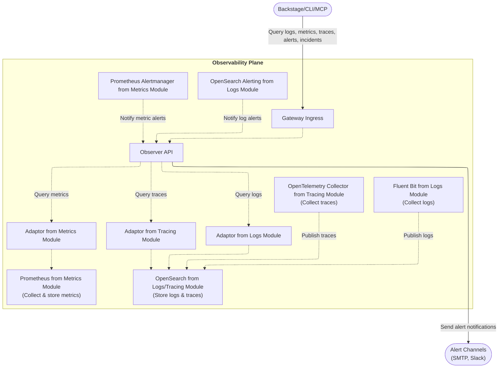
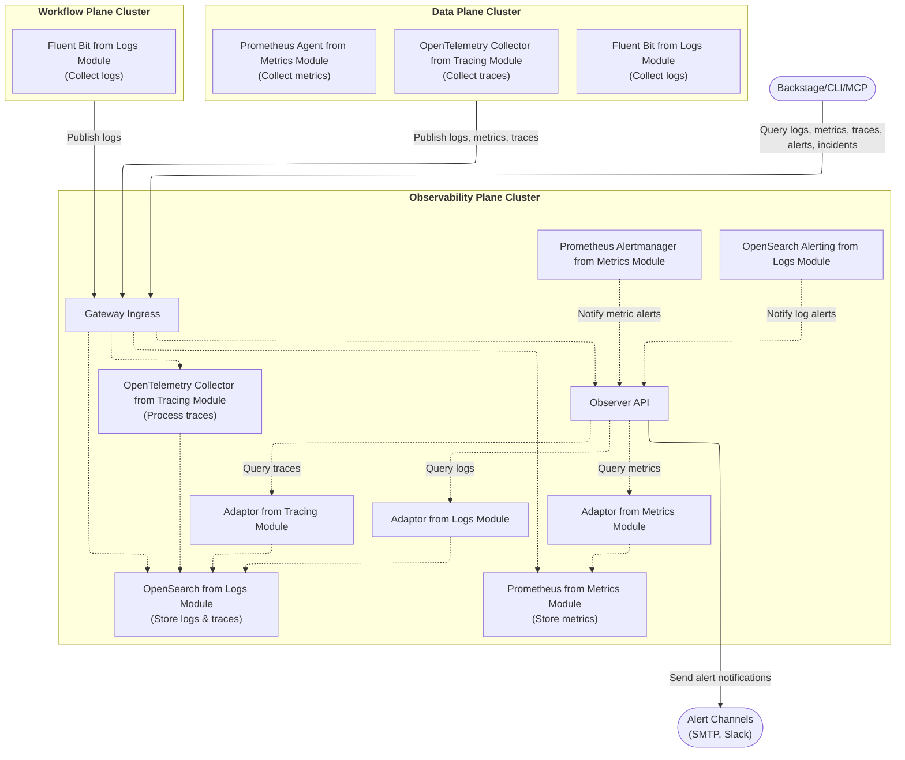
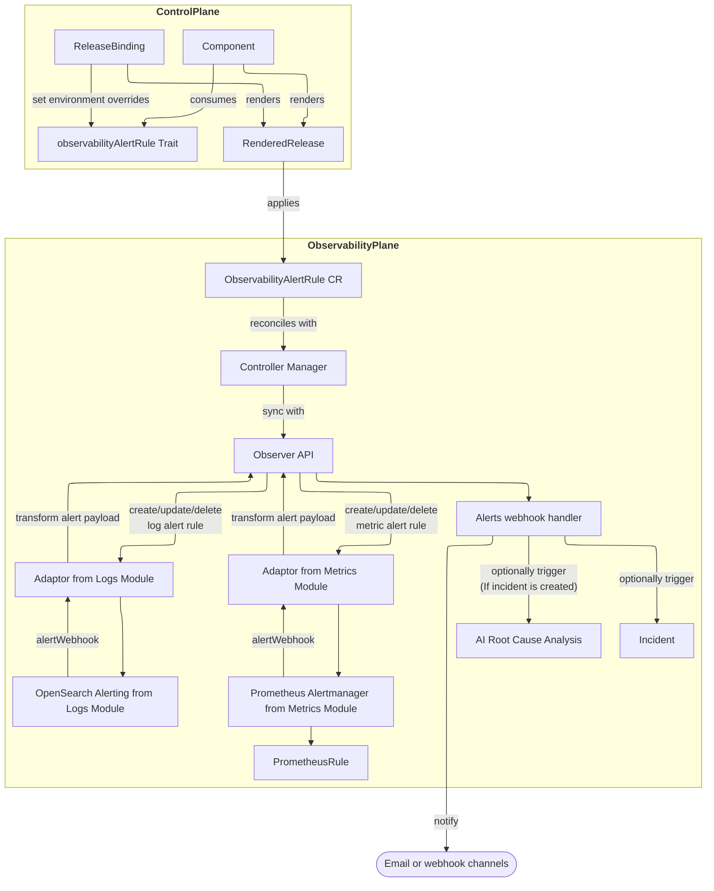

import CodeBlock from "@theme/CodeBlock";
import { versions } from "../_constants.mdx";

# Observability & Alerting

OpenChoreo provides an optional observability plane, which consists of a comprehensive observability stack
for monitoring applications deployed on the platform. The observability plane is designed in a modular architecture
so platform engineers can configure the observability plane to fit their needs, using the tools and technologies they are familiar with.

The observability plane ships a selected set of modules by default when installed,
but platform engineers can replace or supplement the default modules with any community module.

## Overview

OpenChoreo's default observability architecture consists of:

| Pillar      | Components                                                                                                                                                      |
| ----------- | --------------------------------------------------------------------------------------------------------------------------------------------------------------- |
| **Logs**    | A logs collector deployed to the data plane, and a logs storage deployed to the observability plane (defaults to observability-logs-opensearch module)          |
| **Metrics** | A metrics collector deployed to the data plane, and a metrics storage deployed to the observability plane (defaults to observability-metrics-prometheus module) |
| **Traces**  | A traces collector deployed to the data plane, and a traces storage deployed to the observability plane (defaults to observability-tracing-opensearch module)   |

All observability data is accessible through the **Observer API**, which provides a unified interface for querying logs, metrics, and traces.

Alerting is a feature provided by the observability plane, which is integrated with logs and metrics modules to facilitate a unified alerting experience across the platform.

## Architecture

### Single-Cluster Setup

In single-cluster mode, all planes run in the same Kubernetes cluster.
Observability data is collected directly from the data planes and workflow plane
via the agents deployed in the observability plane.



### Multi-Cluster Setup

Multi-cluster mode is designed to run the observability plane on a dedicated cluster.
Data planes and workflow plane deploy local collectors from the respective observability modules that publish observability data
to the observability plane through the gateway ingress of the observability plane.



In this setup:

- **Data Plane** deploys Fluent Bit to collect logs, Prometheus Agent to collect metrics, and OpenTelemetry Collector to collect traces
- **Workflow Plane** deploys Fluent Bit to collect workflow run logs
- All collectors publish data through the **Gateway Ingress** in the Observability Plane
- The **Observer API** queries OpenSearch and Prometheus to serve unified observability data

For detailed multi-cluster setup instructions, see [Multi-Cluster Connectivity](./multi-cluster-connectivity.mdx).

## Prerequisites

- OpenChoreo control plane installed
- Data plane and workflow plane (optional) installed to observe
- Observability plane installed (see [Installation](#installing-the-observability-plane))

## Installing the Observability Plane

Refer to [Getting Started](../getting-started/try-it-out/on-k3d-locally.mdx#step-7-setup-observability-plane-optional)
or [Multi-Cluster Connectivity](./multi-cluster-connectivity.mdx#observability-plane)
for instructions on installing the observability plane in single-cluster or multi-cluster mode.

---

## Observability

### Logs

OpenChoreo observability logs module collects container logs from all containers in the cluster, except for the logs collector containers.
Collected logs are enriched with Kubernetes metadata to support querying by OpenChoreo concepts (projects, components, environments, etc.).

#### Querying Logs

The Observer API provides a REST API for querying logs of a specific OpenChoreo component or a workflow run using OpenChoreo concepts as filters.
This can be accessed via the Backstage portal, OpenChoreo CLI or OpenChoreo MCP server.
Observer handles the authentication and authorization based on OpenChoreo user identity.

---

### Metrics

OpenChoreo observability metrics module collects metrics using for container resource metrics (CPU, memory) and HTTP request metrics (when instrumented via Hubble with Cilium CNI).
The metrics are also supported to be queried by OpenChoreo concepts (projects, components, environments, etc.).

#### Querying Metrics

The Observer API provides a REST API for querying metrics of a specific OpenChoreo component using OpenChoreo concepts as filters.
This can be accessed via the Backstage portal or the OpenChoreo MCP server.
Observer handles the authentication and authorization based on OpenChoreo user identity.

---

### Traces

OpenChoreo observability tracing module collects traces from applications that are instrumented to publish traces via [OpenTelemetry Protocol (OTLP)](https://opentelemetry.io/docs/specs/otlp/).
The traces are enriched with Kubernetes metadata to support querying by OpenChoreo concepts (projects, components, environments, etc.).

#### Instrumenting Applications

Applications must be instrumented to send traces to the OpenTelemetry Collector. Configure your application to send OTLP traces to one of the following endpoints when using single-cluster mode:

| Protocol | Endpoint                                                                                         |
| -------- | ------------------------------------------------------------------------------------------------ |
| HTTP     | `http://opentelemetry-collector.openchoreo-observability-plane.svc.cluster.local:4318/v1/traces` |
| gRPC     | `opentelemetry-collector.openchoreo-observability-plane.svc.cluster.local:4317`                  |

When using multi-cluster mode, the traces are published to the observability plane through the gateway ingress of the observability plane. Configure the applications accordingly.

**Example: OpenTelemetry SDK Configuration (Go)**

```go
import (
    "go.opentelemetry.io/otel"
    "go.opentelemetry.io/otel/exporters/otlp/otlptrace/otlptracehttp"
)

exporter, _ := otlptracehttp.New(ctx,
    otlptracehttp.WithEndpoint("opentelemetry-collector.openchoreo-observability-plane:4318"),
    otlptracehttp.WithInsecure(),
)
```

#### Querying Traces

The Observer API provides REST APIs for querying traces and spans using OpenChoreo concepts as filters.
This can be accessed via the Backstage portal or the OpenChoreo MCP server.
Observer handles the authentication and authorization based on OpenChoreo user identity.

---

## Alerting

OpenChoreo provides a unified alerting experience based on logs and resource usage metrics.
Alert rules are defined as traits on components and are automatically created for each environment by the control plane during component releases.
Alert notifications are configured as notification channels and are sent through the configured channels when an alert is triggered.

### Alerting architecture

The following diagram shows the end-to-end alerting flow across planes:



### Alert Rule Configuration (Developers)

OpenChoreo ships a default trait named `observability-alert-rule` that can be used to define alert rules on components.
Platform engineers can define their own traits to provide platform-specific alert rules as required.

In your `Component` definition, attach alert rules as traits:

```yaml
traits:
  - name: observability-alert-rule
    kind: Trait
    instanceName: high-error-rate-log-alert
    parameters:
      description: "Triggered when error logs count exceeds 50 in 5 minutes."
      severity: "critical"
      source:
        type: "log"
        query: "status:error"
      condition:
        window: 5m
        interval: 1m
        operator: gt
        threshold: 50
```

This trait will create an `ObservabilityAlertRule` CR with `spec.source` and `spec.condition` set from the parameters, and an `actions` block that can be customized per environment.

### Environment-Specific Overrides (Platform Engineers)

Environment-specific parameters for the alert rule (such as enabling/disabling the rule, choosing notification channels, and toggling incident/AI root cause analysis) are configured in the `ReleaseBinding` CR via `traitEnvironmentConfigs`:

```yaml
spec:
  traitEnvironmentConfigs:
    high-error-rate-log-alert:
      enabled: true
      actions:
        notifications:
          channels:
            - devops-email-notifications
        incident:
          enabled: true
          triggerAiRca: false
```

This tells the control plane to:

- enable the alert rule in this environment,
- send notifications to the `devops-email-notifications` `ObservabilityAlertsNotificationChannel`, and
- create incidents (without AI RCA) when the rule fires.

### Alert Source Types

| Type     | Description           | Use Case                              |
| -------- | --------------------- | ------------------------------------- |
| `log`    | Log-based alerting    | Error patterns, specific log messages |
| `metric` | Metric-based alerting | Resource utilization (CPU, memory)    |

### Alert Condition Operators

| Operator | Description           |
| -------- | --------------------- |
| `gt`     | Greater than          |
| `lt`     | Less than             |
| `gte`    | Greater than or equal |
| `lte`    | Less than or equal    |
| `eq`     | Equal to              |

### Notification Channels

Configure notification channels to receive alerts.
Platform Engineers can configure notification channels per environment.
The first notification channel created in an environment is marked as the default channel.
The default channel is used by alert rules that don't specify a channel.

OpenChoreo currently supports the following notification channel types:

- **Email**: Sends alerts via SMTP email.
- **Webhook**: Sends alerts as HTTP POST requests to an external endpoint.

#### Email Notification Channel Example

Email templates support CEL expressions for dynamic content.
Available CEL variables for templates include: `${alertName}`, `${alertSeverity}`, `${alertDescription}`,
`${alertValue}`, `${alertTimestamp}`, `${alertThreshold}`, `${alertType}`, `${component}`, `${project}`,
`${environment}`, `${componentId}`, `${projectId}`, `${environmentId}`, and `${triggerAiRca}`.

```yaml
apiVersion: openchoreo.dev/v1alpha1
kind: ObservabilityAlertsNotificationChannel
metadata:
  name: my-notification-channel
  namespace: default
spec:
  environment: development
  isEnvDefault: true
  type: email
  emailConfig:
    from: alerts@example.com
    to:
      - team@example.com
      - oncall@example.com
    smtp:
      host: smtp.example.com
      port: 587
      auth:
        username:
          secretKeyRef:
            name: smtp-credentials
            key: username
        password:
          secretKeyRef:
            name: smtp-credentials
            key: password
      tls:
        insecureSkipVerify: false
    template:
      subject: "[${alertSeverity}] ${alertName} Triggered"
      body: |
        Alert: ${alertName}
        Severity: ${alertSeverity}
        Time: ${alertTimestamp}
        Description: ${alertDescription}
        Component: ${component}
        Project: ${project}
        Environment: ${environment}
```

#### Webhook Notification Channel Example

Use a webhook notification channel to deliver alerts to an HTTP endpoint
(for example, a custom incident management system, notification system such as Slack, or a chatops bridge).
The `payloadTemplate` can be templated using CEL expressions. If `payloadTemplate` is omitted, the full alert payload is sent as JSON.

Available CEL variables for templates include: `${alertName}`, `${alertSeverity}`, `${alertDescription}`,
`${alertValue}`, `${alertTimestamp}`, `${alertThreshold}`, `${alertType}`, `${component}`, `${project}`,
`${environment}`, `${componentId}`, `${projectId}`, `${environmentId}`, `${alertIncidentEnabled}`, and `${alertTriggerAiRca}`.

```yaml
apiVersion: openchoreo.dev/v1alpha1
kind: ObservabilityAlertsNotificationChannel
metadata:
  name: my-webhook-channel
  namespace: default
spec:
  environment: development
  isEnvDefault: false
  type: webhook
  webhookConfig:
    url: https://alerts.example.com/webhook
    headers:
      X-OpenChoreo-Source:
        value: observer
      Authorization:
        valueFrom:
          secretKeyRef:
            name: webhook-token
            key: token
    payloadTemplate: |
      {
        "alertName": "${alertName}",
        "alertSeverity": "${alertSeverity}",
        "alertTimestamp": "${alertTimestamp}",
        "alertDescription": "${alertDescription}"
      }
```

### AI-Powered Root Cause Analysis

When incident creation and AI RCA are enabled for an alert rule (via `actions.incident.enabled: true` and `actions.incident.triggerAiRca: true`), OpenChoreo's SRE Agent automatically analyzes the incident and generates a root cause analysis report.

Platform engineers configure the SRE Agent deployment via the observability plane Helm chart (`rca.*` values), and enable AI RCA for an alert rule through trait environment configs and `ReleaseBinding` overrides.

See [SRE Agent](../ai/sre-agent.mdx) for configuration details.

### Viewing Alerts and Incidents

Once alert rules are in place and notifications are configured, OpenChoreo also persists alert events and incidents in the observability plane.
You can query them via the Observer API. This can be accessed via the Backstage portal or the OpenChoreo MCP server.
Observer handles the authentication and authorization based on OpenChoreo user identity.

For a full, end-to-end walkthrough of defining alert rules, configuring channels, and triggering alerts, refer to the [Component Alerts sample](https://github.com/openchoreo/openchoreo/tree/main/samples/component-alerts).

### Configuring Alert Storage

Alert entries and incidents are persisted in a storage backend. The Observer supports two backends: **SQLite** (default) and **PostgreSQL**.

#### SQLite (Default)

By default, alert entries and incidents are stored in an SQLite database backed by a `ReadWriteOnce` PersistentVolumeClaim. This is the simplest option and requires no external database.

```yaml
observer:
  alertStoreBackend: sqlite # default
  alertStoreSqliteSize: 128Mi # PVC size for the SQLite database
  replicas: 1 # must be 1 with SQLite (ReadWriteOnce PVC)
  secretName: observer-secret # Secret with OPENSEARCH_USERNAME, OPENSEARCH_PASSWORD, UID_RESOLVER_OAUTH_CLIENT_SECRET
```

:::note
When using the SQLite backend, `observer.replicas` must be `1` because the PVC uses `ReadWriteOnce` access mode. Attempting to set a higher replica count will cause the Helm install to fail.
Also, the deployment strategy is set to `Recreate` to avoid multiple pods running at the same time.
:::

#### PostgreSQL

For production deployments that require high availability or horizontal scaling, configure the Observer to use a PostgreSQL backend. This allows running multiple Observer replicas.

**Step 1: Create a PostgreSQL database for the Observer.**

Provision a PostgreSQL database (e.g., `openchoreo_observer`) and create a dedicated user with read/write access to it.

**Step 2: Add `ALERT_STORE_DSN` to the existing `observer-secret`.**

The `ALERT_STORE_DSN` value must be a standard PostgreSQL connection URL:

```
postgresql://<user>:<password>@<host>:<port>/<dbname>?sslmode=<mode>
```

Update the `ExternalSecret` named `observer-secret` in the `openchoreo-observability-plane` namespace to include `ALERT_STORE_DSN`:

```yaml
data:
  - secretKey: ALERT_STORE_DSN
    remoteRef:
      key: <path-to-your-secret>
```

**Step 3: Upgrade the Helm release with the updated values.**

```yaml
observer:
  alertStoreBackend: postgresql
  secretName: observer-secret
  replicas: 2 # can scale beyond 1 with PostgreSQL
```

Apply the updated values with `helm upgrade`.

For all available alert storage configuration options, see the [Observability Plane Helm Reference](../reference/helm/observability-plane.mdx#observer).

---

## Configuration Reference

### Key Helm Values

| Value                                      | Default | Description                                          |
| ------------------------------------------ | ------- | ---------------------------------------------------- |
| `observability-logs-opensearch.enabled`    | `false` | Enable OpenSearch based community module for logs    |
| `observability-metrics-prometheus.enabled` | `false` | Enable Prometheus based community module for metrics |
| `observability-tracing-opensearch.enabled` | `false` | Enable OpenSearch based community module for traces  |
| `rca.enabled`                              | `false` | Enable AI SRE Agent                                  |

For complete configuration options, see the [Observability Plane Helm Reference](../reference/helm/observability-plane.mdx).

---

## Troubleshooting

### Alert Not Firing

1. Verify the alert rule status after a component is deployed:

   ```bash
   kubectl get observabilityalertrules -n <namespace>
   kubectl describe observabilityalertrule <name> -n <namespace>
   ```

   Alert Rule Status should reflect if the alert rule was properly synced with the observability backend.
   If alert rule is not available, check the `release`, `releasebinding`, `componentrelease` status to verify if the alert rule was properly applied to the observability plane.

2. Check the Observer logs for alert processing errors:

   ```bash
   kubectl logs -n openchoreo-observability-plane deployment/observer
   ```

---

## Related Documentation

- [SRE Agent](../ai/sre-agent.mdx) - AI-powered root cause analysis
- [Deployment Topology](./deployment-topology.mdx) - Multi-plane architecture overview
- [Multi-Cluster Connectivity](./multi-cluster-connectivity.mdx) - Connecting planes across clusters
- [Observability Plane Helm Reference](../reference/helm/observability-plane.mdx) - Complete Helm configuration options
